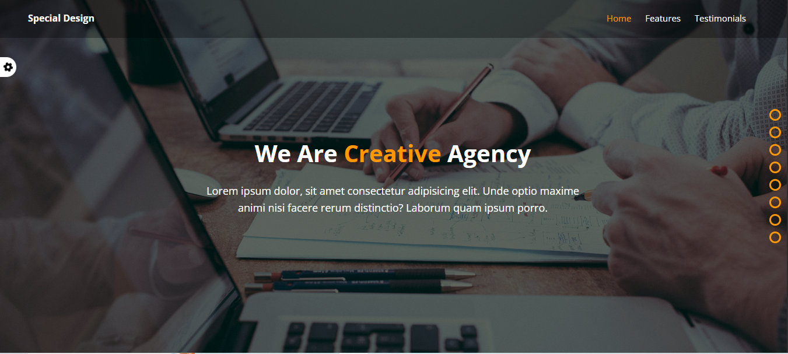
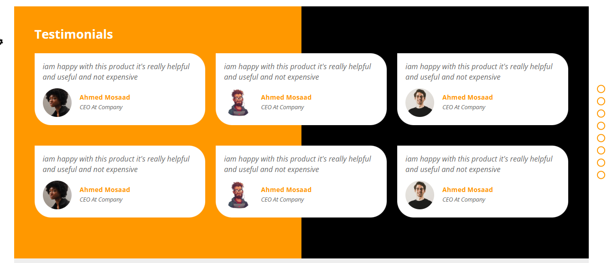
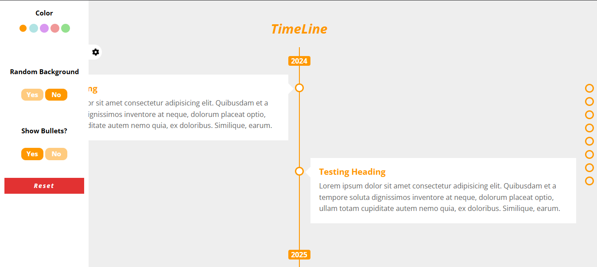
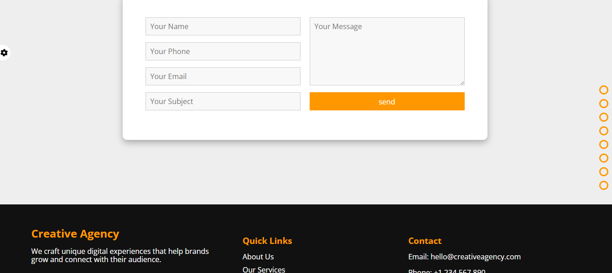
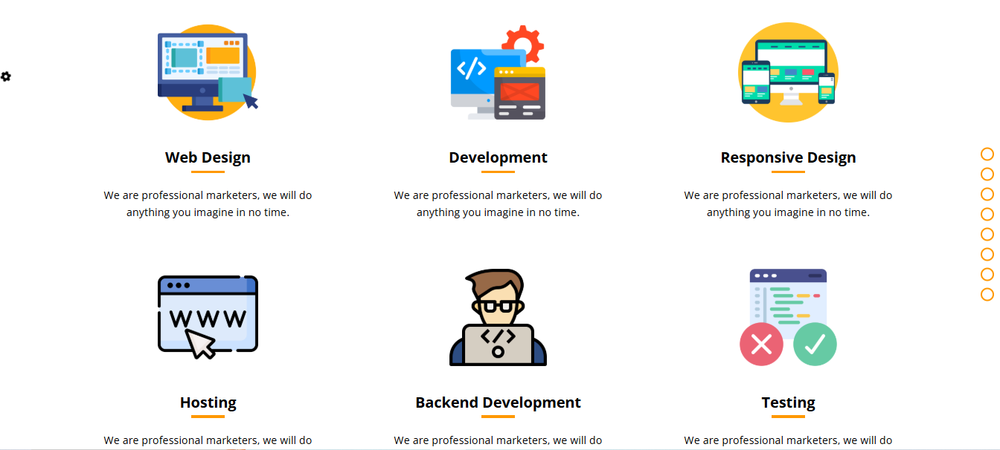
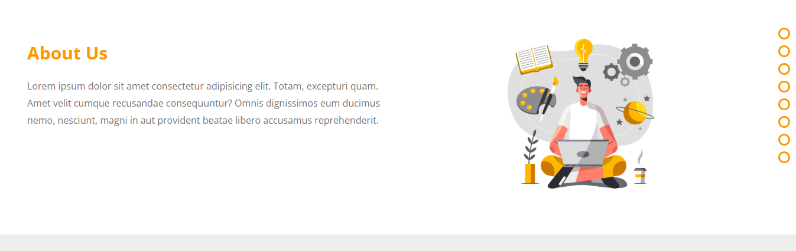

# Creative Agency
A modern web website
## :clipboard: Project Overview

  
  
  
  
  
  

## :sparkler: Features

  - **:iphone: Login :** Login UI (no authentication → takes user to the home page or user can continue as a guest).

## :computer: Technology Stack

  
  
  

live preview:https://mostafa-ashraf0.github.io/creative-agency-web-page/
